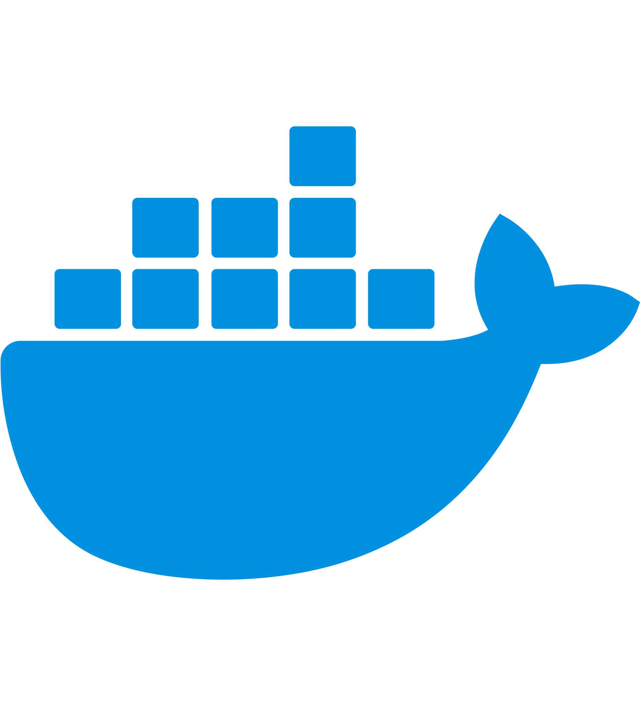

<a href="mailto:khnaz35@gmail.com">

       
    <picture>
        <source media="(prefers-color-scheme: dark)" srcset="assets/header_dark.svg">
        <source media="(prefers-color-scheme: light)" srcset="assets/header_light.svg">
        
    </picture>

</a>

# 
Senior Linux Administrator & Full Stack Web Developer

### 
🌐 Delivering efficient, scalable, and secure solutions for over 15 years 🌐
 

-   🌱 I’m currently expanding my expertise in **Terraform**, and **ERPNext** to build next-gen scalable infrastructure.
-   💻 My projects and repositories reflect my experience in **Linux administration**, **API development**, and **eCommerce solutions**.
-   ✉️ Reach me at [khnaz35@gmail.com](mailto:khnaz35@gmail.com).

 

 

<table align="center">
<tr>
<td align="center" valign="top" width="140px">

### Frontend

<picture>
	
</picture>
<picture>
	
</picture>
<picture>
	
</picture>
<picture>
	
</picture>
</td>

<td align="center" valign="top" width="140px">

### Backend

<picture>
	
</picture>
<picture>
	
</picture>
<picture>
	
</picture>
<picture>
	
</picture>
</td>

<td align="center" valign="top" width="140px">

### DevOps

<picture>
	
</picture>
<picture>
	
</picture>
<picture>
	
</picture>
<picture>
	
</picture>
</td>

<td align="center" valign="top" width="140px">

### Database

<picture>
	
</picture>
<picture>
	
</picture>
<picture>
	
</picture>
<picture>
	
</picture>
</td>

<td align="center" valign="top" width="140px">

### Tools & Platforms

<picture>
	
</picture>
<picture>
	
</picture>
<picture>
	
</picture>
<picture>
	
</picture>
</td>

</tr>
</table>

 
