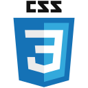
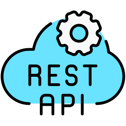
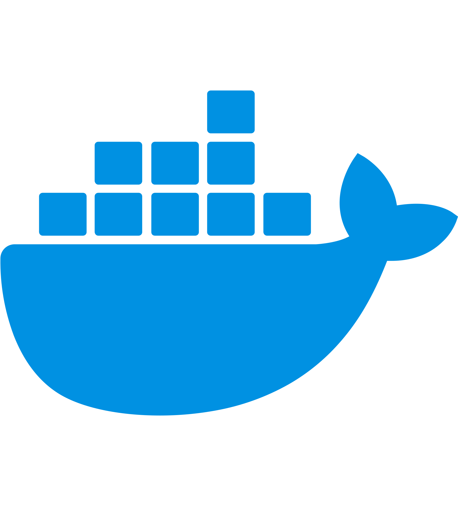

<a href="mailto:khnaz35@gmail.com">

       
    <picture>
        <source media="(prefers-color-scheme: dark)" srcset="assets/header_dark.svg">
        <source media="(prefers-color-scheme: light)" srcset="assets/header_light.svg">
        
    </picture>

</a>

# 
Senior Linux Administrator & Full Stack Web Developer

### 
18 years keeping Linux servers and eCommerce stores running
 

<strong>Available now for contract and emergency work</strong> 
Malaysia (UTC+8) - full coverage of Australian business hours, European mornings 
<a href="mailto:khnaz35@gmail.com">khnaz35@gmail.com</a> and <a href="https://lookersolution.com">lookersolution.com</a>

## What I fix

-   **Hacked site recovery** - malware removal, injected code cleanup, backdoor hunting, post-cleanup hardening. OpenCart, WordPress, Magento. Usually inside 24 hours.
-   **Server migration** - cPanel to cPanel, shared to VPS, host to host. Planned for zero downtime, with rollback.
-   **Server triage** - load spikes, disk exhaustion, slow MySQL, mail landing in spam, broken SSL and DNS.
-   **ERPNext deployment** - install and configure on VPS, SSL, automated backups, version upgrades.
-   **Development** - Python/Django, PHP, REST API design and integration, OpenCart extensions.

I also work white-label for agencies that need a server person on call without carrying one on payroll.

 

 

<table align="center">
<tr>
<td align="center" valign="top" width="140px">

### Frontend

<picture>
	
</picture>
<picture>
	
</picture>
<picture>
	
</picture>
<picture>
	
</picture>
</td>

<td align="center" valign="top" width="140px">

### Backend

<picture>
	
</picture>
<picture>
	
</picture>
<picture>
	
</picture>
<picture>
	
</picture>
</td>

<td align="center" valign="top" width="140px">

### DevOps

<picture>
	
</picture>
<picture>
	
</picture>
<picture>
	
</picture>
<picture>
	
</picture>
</td>

<td align="center" valign="top" width="140px">

### Database

<picture>
	
</picture>
<picture>
	
</picture>
<picture>
	
</picture>
<picture>
	
</picture>
</td>

<td align="center" valign="top" width="140px">

### Tools & Platforms

<picture>
	
</picture>
<picture>
	
</picture>
<picture>
	
</picture>
<picture>
	
</picture>
</td>

</tr>
</table>

 

## Selected work

[OpenCart-Fortress](https://github.com/Khnaz35/OpenCart-Fortress) - hardened .htaccess configurations for locking down OpenCart installations against injection, bot traffic, and directory exposure.

## Working together

-   Fixed price quoted before any work starts, so you know the number up front.
-   50% deposit, balance on completion.
-   Every job ends with a written report of what was found and what was changed.

Email [khnaz35@gmail.com](mailto:khnaz35@gmail.com) with what is broken and I will send you a quote.
